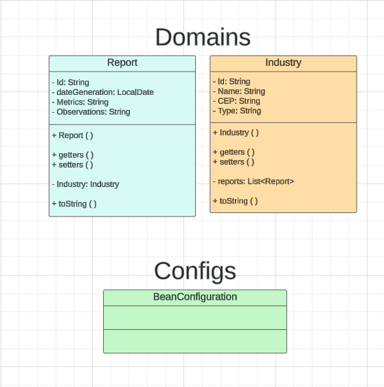
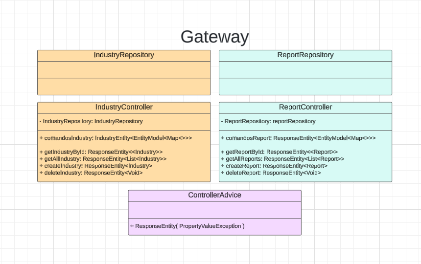

# *GlobalSolution - Java*

### Sumário
- [Objetivo](#objetivo)
- [Diagrama de Classes](#diagrama-de-classes)
- [Instrução para rodar a aplicação](#instrução-para-rodar-a-aplicação)

## Objetivo
O projeto visa criar uma solução por meio de um sistema de monitoramento e otimização de energia renovável em comunidades isoladas e urbanas

## Diagrama de Classes



## Instrução para rodar a aplicação

Para configurar sua aplicação, acesse o arquivo `application.properties`. Neste arquivo, você encontrará propriedades que permitem personalizar o comportamento da sua aplicação.
Para conectar ao banco de dados, localize as propriedades username password. Nestas propriedades, insira respectivamente o nome de usuário e a senha para acessar o seu banco de dados. 

### Exemplo:
```
{
  datasource:
  url: jdbc:oracle:thin:@oracle.fiap.com.br:1521:orcl
  username: usuario
  password: senha
  driver-class-name: oracle.jdbc.OracleDriver
  jpa:
  hibernate:
  ddl-auto: create
  database-platform: org.hibernate.dialect.OracleDialect
}
```
Após realizar as alterações, salve o arquivo e execute a aplicação. A aplicação utilizará as novas credenciais para se conectar ao banco de dados.

## Integrantes
Cauã Loureiro RM553093
Igor Oviedo RM553434
Thiago Carrillo RM553565


